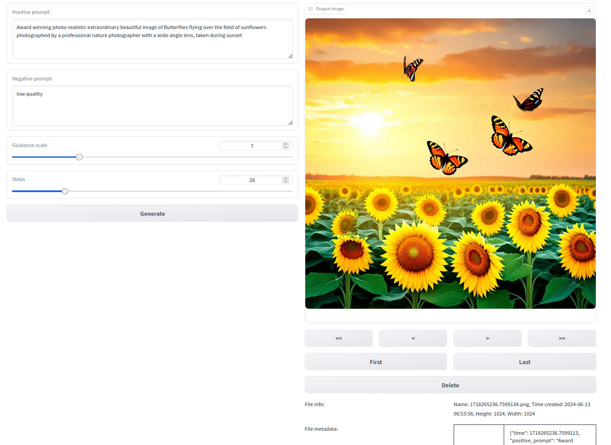

# Simple SD3
Simple SD3 offers a lightweight web interface to Stable Diffusion 3 using Gradio.


<figure>
  
  <figcaption>Main UI</figcaption>
</figure>

# Hardware & software requirements
This was only tested on Ubuntu with NVIVIA RTX 4090, so it's unclear if it works on a host with less GPU memory or a different OS.

Using nvidia-smi command, I see:
17320MiB after starting up the app
21842MiB after image generation

and it's unclear if it uses less VRAM if available memory is lower.

# How to install Simple SD3

Currently, only systems with NVIDIA GPU and CUDA are supported.
I am using Linux and these steps have not been tested on Windows yet.

### Overview
1. Copy Simple SD3 files from github
1. Set up conda environment
1. Install Pytorch
1. Install xformers
1. Install other python packages
1. Copy model files

### Steps
1. Copy Simple SD3 files from github

   Open the terminal and go to a directory that you want to install Simple SD3.
   Type:
   ```
   git clone https://github.com/HowToSD/simple_sd3.git
   ```

2. Set up conda environment

    Run the following. Note that if your system does not have conda, you need to install it first.

    ```
    conda create -n simplesd3 python=3.10
    conda activate simplesd3
    ```

3. Install Pytorch
   
    ```
    conda install pytorch torchvision torchaudio pytorch-cuda=12.1 -c pytorch -c nvidia
    ```
    For more information, refer to the installation section at https://pytorch.org/.

4. Install xformers

    ```
    conda install xformers -c xformers
    ```

5. Install other python packages

    Install these packages and make sure that you have no errors:
    ```
    pip install -U diffusers
    pip install transformers[sentencepiece]
    pip install accelerate
    ```

    Install the rest of the packages.
    ```
    pip install -r requirements.txt
    ```

6. Create an access token at Hugging Face.
   You need to an access token at Hugging Face.
   Create one at https://huggingface.co/settings/tokens

7. Copy model files
   Make sure that you have "git lfs" on your system.
   You can type:
   ```
   git lfs version
   ```
   to see if it's installed. If not install it first.

   Now in a temporary directory, type:
   ```
   git clone https://<your Hugging Face user ID>:<Hugging Face Access token>@huggingface.co/stabilityai/stable-diffusion-3-medium-diffusers
   ```
   Replace <your Hugging Face user ID> and <Hugging Face Access token> with your user ID and your access token.
   Once the files are downloaded, copy them to the "checkpoint" directory under the simple_sd3 source tree.

8. Start Simple SD3
   Type:
   ```
   python simple_sd3.py
   ```
   This should start Gradio.

9.  Using your browser, access the URL displayed in the above.

Also refer to https://huggingface.co/stabilityai/stable-diffusion-3-medium-diffusers for more information.
